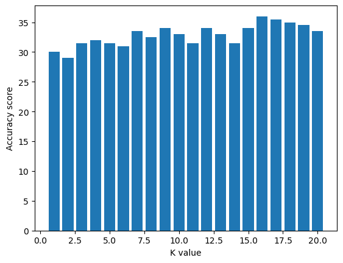

# Telecommunications Provider based on KNN algorithm

Telecommunications Provider based on KNN algorithm

A communication service provider can divide a customer's membership into four categories based on multiple independent variables such asage, region, material, income, etc.

#### Independed Variables
- region
- tenure
- age
- marital
- addree
- income
- ed
- employ
- retire
- gender
- reside
#### Target (depended varibale)
- custcat

#### Tools
To work with this project, multiple libraries and frameworks need to be installed. The following is a list of them.


- [Pandas](https://pandas.pydata.org/)
- [NumPy](https://numpy.org/)
- [Matplotlib](https://matplotlib.org/)
- [Sciki-learn](https://scikit-learn.org/stable/)

#### Import the required packets.


```python
import numpy as np
import pandas as pd
import matplotlib.pyplot as plt
from sklearn import preprocessing
```

#### Load the data


```python
df = pd.read_csv('teleCust1000t.csv')
df.head(3)
```


<div>
<style scoped>
    .dataframe tbody tr th:only-of-type {
        vertical-align: middle;
    }

    .dataframe tbody tr th {
        vertical-align: top;
    }

    .dataframe thead th {
        text-align: right;
    }
</style>
<table border="1" class="dataframe">
  <thead>
    <tr style="text-align: right;">
      <th></th>
      <th>region</th>
      <th>tenure</th>
      <th>age</th>
      <th>marital</th>
      <th>address</th>
      <th>income</th>
      <th>ed</th>
      <th>employ</th>
      <th>retire</th>
      <th>gender</th>
      <th>reside</th>
      <th>custcat</th>
    </tr>
  </thead>
  <tbody>
    <tr>
      <th>0</th>
      <td>2</td>
      <td>13</td>
      <td>44</td>
      <td>1</td>
      <td>9</td>
      <td>64.0</td>
      <td>4</td>
      <td>5</td>
      <td>0.0</td>
      <td>0</td>
      <td>2</td>
      <td>1</td>
    </tr>
    <tr>
      <th>1</th>
      <td>3</td>
      <td>11</td>
      <td>33</td>
      <td>1</td>
      <td>7</td>
      <td>136.0</td>
      <td>5</td>
      <td>5</td>
      <td>0.0</td>
      <td>0</td>
      <td>6</td>
      <td>4</td>
    </tr>
    <tr>
      <th>2</th>
      <td>3</td>
      <td>68</td>
      <td>52</td>
      <td>1</td>
      <td>24</td>
      <td>116.0</td>
      <td>1</td>
      <td>29</td>
      <td>0.0</td>
      <td>1</td>
      <td>2</td>
      <td>3</td>
    </tr>
  </tbody>
</table>
</div>


Count the number of classes in the 'custcat'


```python
df['custcat'].value_counts()
# len(df['custcat'].value_counts())
```


    3    281
    1    266
    4    236
    2    217
    Name: custcat, dtype: int64


```python
df.columns
```


    Index(['region', 'tenure', 'age', 'marital', 'address', 'income', 'ed',
           'employ', 'retire', 'gender', 'reside', 'custcat'],
          dtype='object')


#### Independent data 


```python
X = df[['region', 'tenure','age', 'marital', 'address', 'income', 'ed', 'employ','retire', 'gender', 'reside']] .values
```

#### Dependent data


```python
y = df['custcat'].values
```

#### Normalize data


```python
stander = preprocessing.StandardScaler()
stander.fit(X)
X = stander.transform(X)
X[:1]
```


    array([[-0.02696767, -1.055125  ,  0.18450456,  1.0100505 , -0.25303431,
            -0.12650641,  1.0877526 , -0.5941226 , -0.22207644, -1.03459817,
            -0.23065004]])


#### Split the data into 80% for training and 20% for testing.


```python
from sklearn.model_selection import train_test_split
X_train, X_test, y_train, y_test = train_test_split( X, y, test_size=0.2, random_state=4)
print ('Train set:', X_train.shape,  y_train.shape)
print ('Test set:', X_test.shape,  y_test.shape)
```

    Train set: (800, 11) (800,)
    Test set: (200, 11) (200,)
    

### K nearest neighbor (KNN)


```python
from sklearn.neighbors import KNeighborsClassifier
k = 2
#Train Model and Predict  
model = KNeighborsClassifier(n_neighbors = k).fit(X_train,y_train)
model
```


    KNeighborsClassifier(n_neighbors=2)


```python
yhat = model.predict(X_test)
yhat[:3]
```


    array([3, 1, 1], dtype=int64)


### Accuracy evaluation


```python
from sklearn import metrics
print("Train set Accuracy: ", metrics.accuracy_score(y_train, model.predict(X_train)))
print("Test set Accuracy: ", metrics.accuracy_score(y_test, yhat))
# result = metrics.classification_report(y_test, yhat)
# result
```

    Train set Accuracy:  0.6175
    Test set Accuracy:  0.29
    

#### Changing the K value


```python
k = 20
results = []
for i in range(1,k+1):
    neigh = KNeighborsClassifier(n_neighbors = i).fit(X_train,y_train)
    yhat = neigh.predict(X_test)
    ac = metrics.accuracy_score(y_test, yhat)
    results.append(ac)

plt.bar( np.arange(1,k+1), [i * 100 for i in results])
plt.xlabel('K value')
plt.ylabel('Accuracy score')
```


    Text(0, 0.5, 'Accuracy score')


    

    


```python
print('The best accuracy achieved where k is equal to ', str(results.index(max(results))), "The accuracy is ",str(results[15]*100)+"%")
```

    The best accuracy achieved where k is equal to  15 The accuracy is  36.0%
    

#### Deploying


```python
import joblib
import os
if not os.path.exists('Model'):
        os.mkdir('Model')
if not os.path.exists('Scaler'):
        os.mkdir('Scaler')
        
joblib.dump(model, r'Model/model.pickle')
joblib.dump(stander, r'Scaler/scaler.pickle')

```


    ['Scaler/scaler.pickle']


#### Add new data and load the model


```python
new_data = pd.DataFrame([{'region':2, 'tenure':13,'age':45, 'marital':1, 'address':9, 'income':64.000, 'ed':4, 'employ':5,'retire':0.000, 'gender':0, 'reside':2}])
new_data = new_data[['region', 'tenure','age', 'marital', 'address', 'income', 'ed', 'employ','retire', 'gender', 'reside']]
new_data
```


<div>
<style scoped>
    .dataframe tbody tr th:only-of-type {
        vertical-align: middle;
    }

    .dataframe tbody tr th {
        vertical-align: top;
    }

    .dataframe thead th {
        text-align: right;
    }
</style>
<table border="1" class="dataframe">
  <thead>
    <tr style="text-align: right;">
      <th></th>
      <th>region</th>
      <th>tenure</th>
      <th>age</th>
      <th>marital</th>
      <th>address</th>
      <th>income</th>
      <th>ed</th>
      <th>employ</th>
      <th>retire</th>
      <th>gender</th>
      <th>reside</th>
    </tr>
  </thead>
  <tbody>
    <tr>
      <th>0</th>
      <td>2</td>
      <td>13</td>
      <td>45</td>
      <td>1</td>
      <td>9</td>
      <td>64.0</td>
      <td>4</td>
      <td>5</td>
      <td>0.0</td>
      <td>0</td>
      <td>2</td>
    </tr>
  </tbody>
</table>
</div>


```python
import joblib
model = joblib.load(r'Model/model.pickle')
scaler = joblib.load(r'Scaler/scaler.pickle')
new_data = scaler.transform(new_data)
model.predict(new_data)
```


    array([1], dtype=int64)


